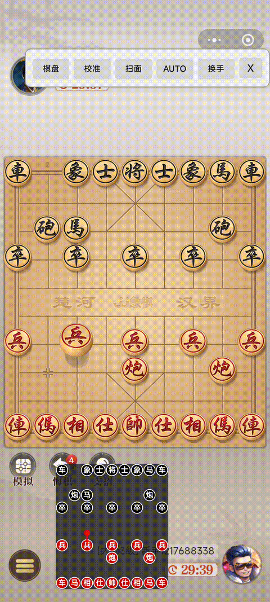

# Android-ChessAI-Assistant

**An end-to-end intelligent Chinese chess solver on Android.**

This project is a **high-performance on-device AI assistant** that combines **Computer Vision (CNN)** and the **PikaFish Engine** to provide real-time move suggestions via a floating overlay UI.



*Quick preview of the recognition → analysis → decision pipeline.*

---

## 🚀 Project Workflow

The application follows a complete data-to-decision pipeline:

1. **Floating UI**
   A custom `WindowManager`-based overlay for non-intrusive user interaction.

2. **Screen Capture**
   Uses the `MediaProjection` API to acquire real-time frames without modifying the target game.

3. **Image Processing**

   * Dynamic chessboard detection and cropping
   * Grid alignment and segmentation into **90 individual square cells**

4. **CNN Inference (On-device)**

   * A lightweight CNN (PyTorch → TFLite) classifies **14 piece types + empty**
   * Optimized for mobile CPU inference

5. **FEN Generation**

   * Converts visual board state into **Forsyth–Edwards Notation (FEN)**

6. **Engine Communication**

   * Sends FEN to the **PikaFish (UCCI)** engine via a background service

7. **Result Overlay**

   * Displays best move and engine evaluation on a simplified mini-board

---

## ⚙️ Technical Highlights

### 1. Mobile Computer Vision & Model Optimization

* **Custom CNN Architecture**
  Designed and trained a compact CNN specialized for Chinese chess piece recognition.

* **TFLite Deployment**
  Converted the model to `.tflite` for efficient on-device inference.

* **INT8 Quantization**
  Applied post-training INT8 quantization to significantly reduce latency and model size with minimal accuracy loss.

* **Robustness**
  Improved generalization across different board themes and lighting conditions using:

  * Brightness & contrast jitter
  * Noise injection
  * Perspective warping

---

### 2. High-Performance Engine Integration

* Integrated the **PikaFish** engine (C++) via **NDK / JNI**
* Implemented a full **UCCI protocol handler**
* Engine runs in a background service to avoid blocking the UI thread

---

### 3. Android UI & System-Level Optimization

* **Floating Overlay UI**

  * Responsive and non-intrusive
  * Works across different game apps

* **Memory & Stability**

  * Optimized `ImageReader` buffer reuse
  * Reduced GC pressure during high-frequency inference

---

## 📊 On-Device Performance Benchmark (INT8 vs FP32)

**Test Device**: Xiaomi 22101320C
**OS**: Android 12 (API 31)
**Test Time**: Jan 25, 2026

| Metric                     | FP32 Model | INT8 Model | Improvement             |
| -------------------------- | ---------- | ---------- | ----------------------- |
| **Average Inference Time** | 371.08 ms  | 207.05 ms  | **1.8× faster**         |
| **Model Size**             | 1.25 MB    | 0.32 MB    | **−74%**                |
| **Estimated Accuracy**     | 99.2%      | 98.5%      | < 1.0% loss             |
| **GC / Memory Jitter**     | Frequent   | Very low   | Significant improvement |

**Conclusion**
On real Android hardware, the INT8 quantized model achieves nearly **2× inference speedup** with negligible accuracy degradation, while greatly reducing CPU load, memory pressure, and device thermal impact—making it suitable for continuous real-time analysis.

---

## 📂 Project Structure

```text
app/src/main/
├── java/.../ui/            # Floating window & overlay UI
├── java/.../vision/        # Image segmentation & TFLite inference wrapper
├── java/.../engine/        # UCCI protocol & PikaFish integration
├── assets/                 # Pre-trained FP32 / INT8 .tflite models
├── cpp/                    # NDK configs & native engine bridge
└── model_training/         # PyTorch training & quantization scripts
```

---

## 🧩 Challenges & Solutions

**Challenge**: Engine computation causing UI stutter
**Solution**:
Moved engine execution into a dedicated background service and communicated with the UI via asynchronous callbacks.

---

**Challenge**: Incorrect FEN output due to occasional misclassification
**Solution**:
Introduced:

* Confidence threshold filtering
* Temporal smoothing across **3 consecutive frames**

---

## 🎯 Conclusion for Recruiters

This project demonstrates strong capability in:

* **End-to-end Android AI engineering**
* **On-device model optimization (FP32 → INT8)**
* **CNN deployment with real performance benchmarking**
* **NDK / JNI integration with native engines**
* **System-level performance and memory tuning**

It reflects my ability to transform AI models into **production-ready, real-time mobile systems** under real hardware constraints.

---

## 📎 Demo Video

[https://github.com/user-attachments/assets/be529804-a7f2-4c57-b8da-d3c1a902e267](https://github.com/user-attachments/assets/be529804-a7f2-4c57-b8da-d3c1a902e267)


